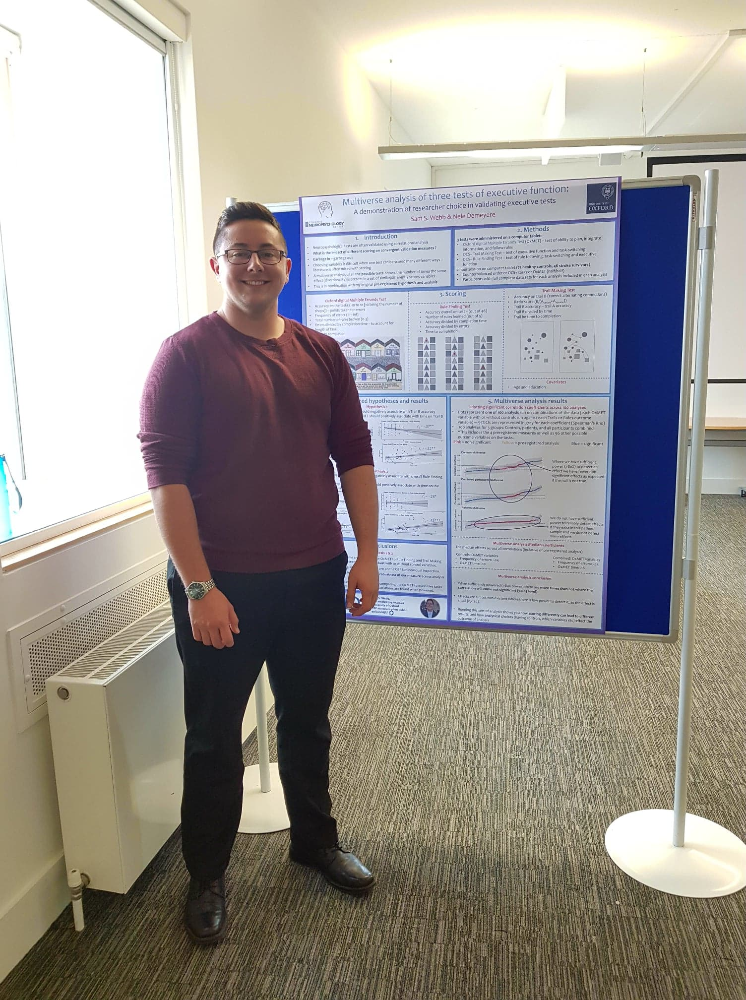
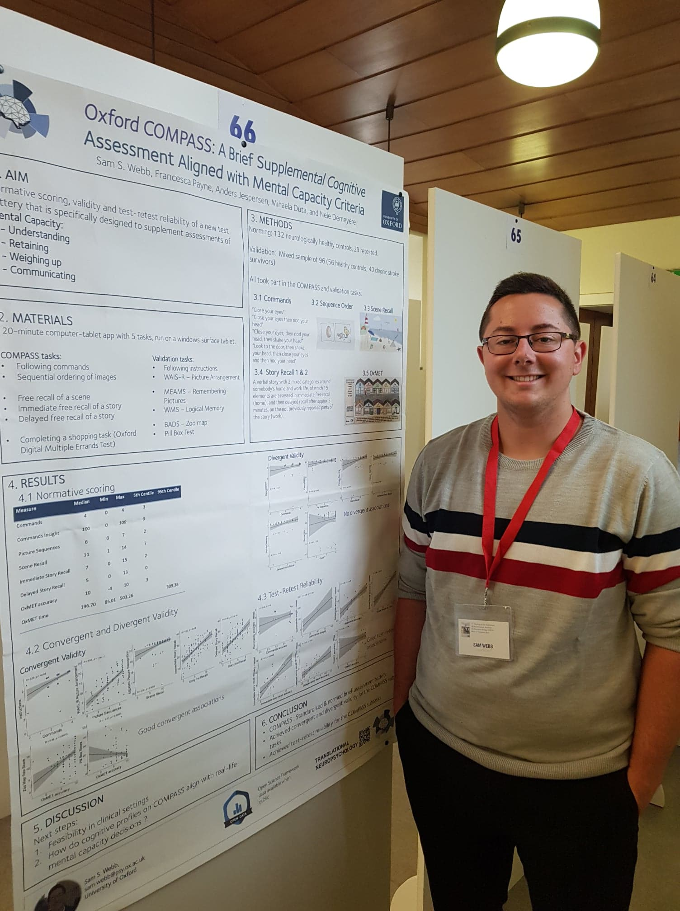

## Poster content and location

*MSc Multiverse Analysis*

- Department of Experimental Psychology, Uni. of Oxford

*Oxford Digital Multiple Errands Test*

- British Neuropsychology Society (BNS) 

*Validation of Executive Tests*

- Organisation for Psychological Research into Stroke (OPSYRIS)

*The COMPASS tool*

- Federation of the European Societies of Neuropsychology (FESN) 

- UK Stroke Forum
