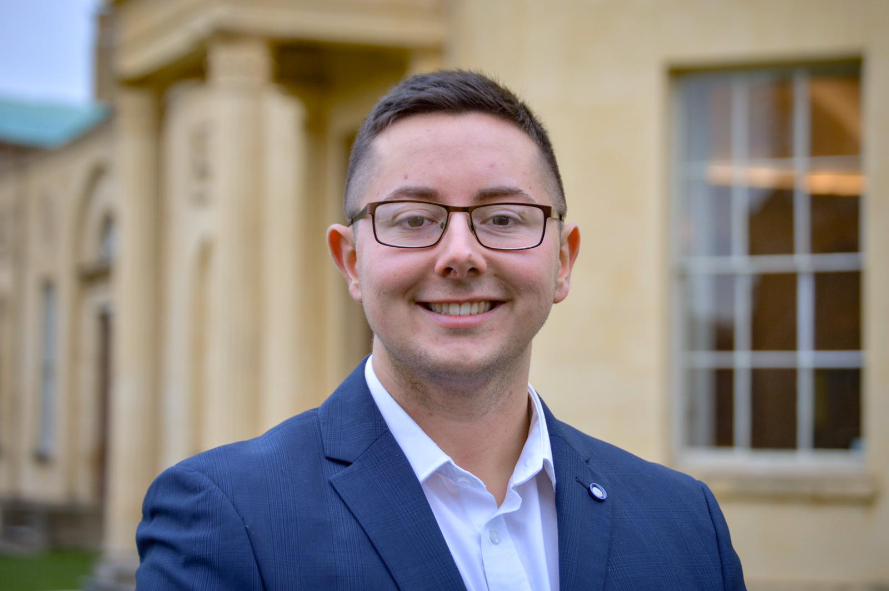

[I try to conduct my research following an open science framework]{style="color:dodgerblue"}

{width="70%"}

This website, hosted through Github and created in RMarkdown, is a repository for all information, publications, posters, and posts related to my academic work.

On the whole, my focus is on executive dysfunction following brain injury (stroke, TBI etc) and how we measure this from an open science perspective. I am particularly interested in clinical tool development, especially validation work.

I am a current DPhil (PhD) candidate at the [Department of Experimental Psychology](https://www.psy.ox.ac.uk/) at University of Oxford, in the for the [Translational Neuropsychology Lab](https://www.psy.ox.ac.uk/research/translational-neuropsychology). In order to fund my studies, I am currently using a governmental loan for the tuition fees and working 60% as a Research Assistant to fund living costs. Unfortunately, my research assistant roles are not within my DPhil topic and as such I am actively seeking research funding.

I completed my MSc in [Psychological Research](https://www.ox.ac.uk/admissions/graduate/courses/msc-psychological-research?wssl=1) at the University of Oxford in England, and completed a BSc in [Psychology with Neuropsychology](https://www.bangor.ac.uk/courses/undergraduate/C801-Psychology-with-Neuropsychology) from Bangor University, in North Wales.
