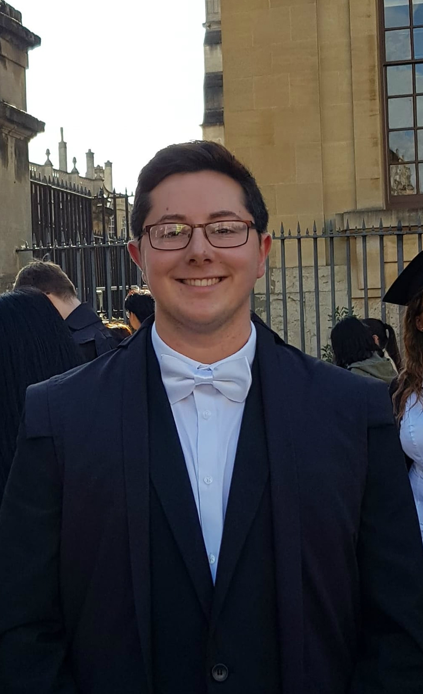
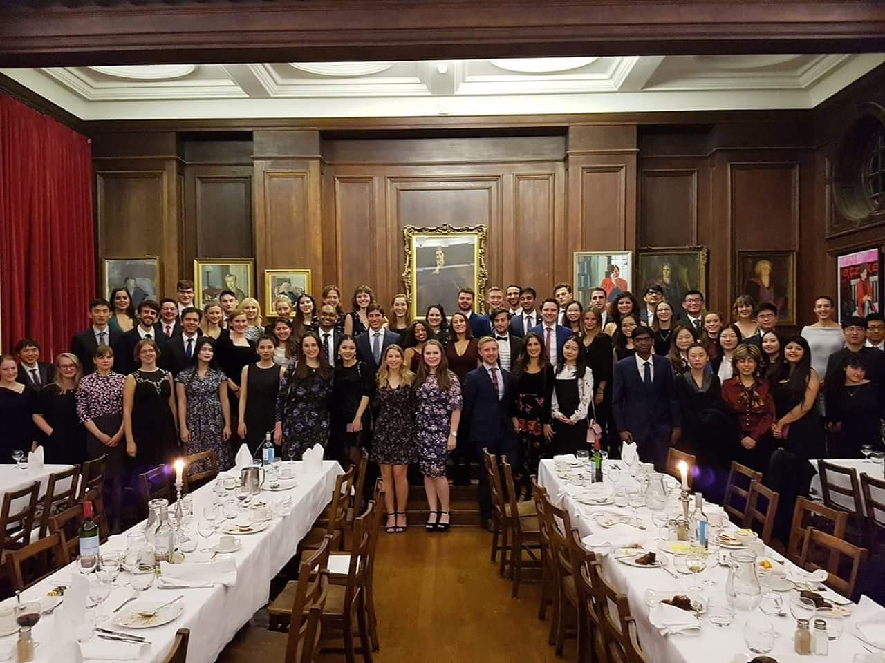

I try to conduct my research following an open science framework

This website, hosted through Github and created in RMarkdown, is a repository for all information, publications, posters, and posts related to my academic work. 

On the whole, my focus is on executive dysfunction following brain injury (stroke, TBI etc) and how we measure this from an open science perspecitive. 

I am a current research assistant for the [Translational Neuropsychology Lab](https://www.psy.ox.ac.uk/research/translational-neuropsychology) at the University of Oxford. 

I completed my MSc in [Psychological Research](https://www.ox.ac.uk/admissions/graduate/courses/msc-psychological-research?wssl=1) at the University of Oxford in England, and completed a BSc in [Psychology with Neuropsychology](https://www.bangor.ac.uk/courses/undergraduate/C801-Psychology-with-Neuropsychology) from Bangor University, in North Wales. I am looking for PhD / DPhil opportunities currently. 

