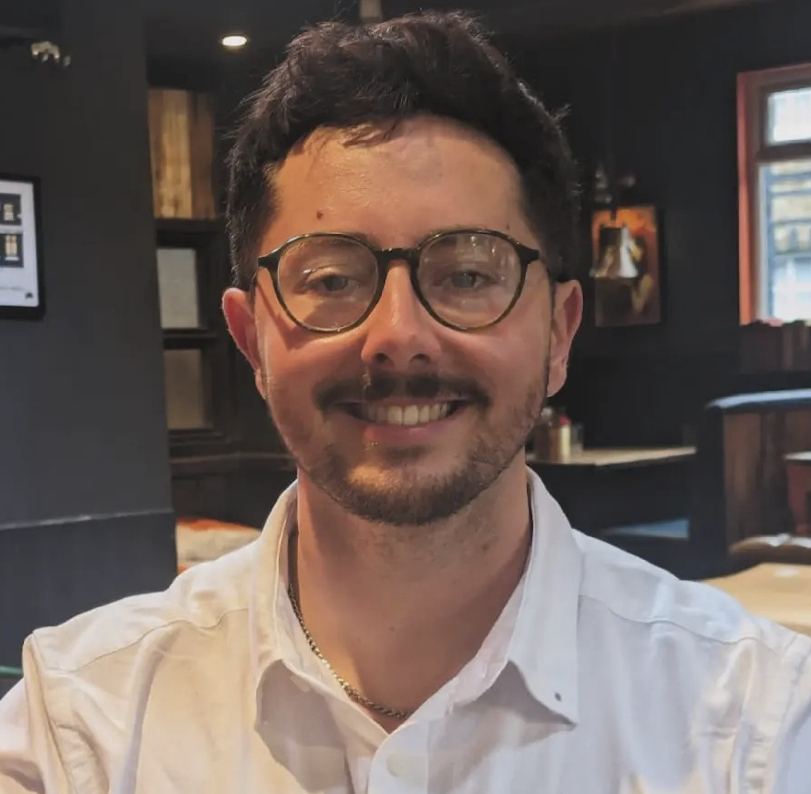

[Currently funded by The Stroke Association with a Postgraduate Fellowship]{style="color:dodgerblue"}

{width="40%"}

Versatile and dedicated post-doctoral researcher with over **6** years of experience in assessment and data collection for diverse research projects involving children to older adults. Proven proficiency in R and R Studio, Microsoft Word, and Excel, combined with a strong background in Psychology and Neuropsychology. Recognized for academic excellence and awarded a fully funded post-graduate fellowship by the Stroke Association for independent research. Adept at personal and group project management. Experience in writing for academic publication, with over 13 publications within a 3-year period. Supervision experience for two MSc students. 

On the whole, my focus is on cognition and how we measure **cognitive dysfunction**. I am particularly interested in clinical tool development, especially **validation** work, and **neuropsychology**.

Completed DPhil at the [Department of Experimental Psychology](https://www.psy.ox.ac.uk/) at University of Oxford, for the [Translational Neuropsychology Lab](https://www.psy.ox.ac.uk/research/translational-neuropsychology). I was awarded a fully funded Postgraduate Fellowship through [The Stroke Association](https://www.stroke.org.uk). 

I completed my MSc in [Psychological Research](https://www.ox.ac.uk/admissions/graduate/courses/msc-psychological-research?wssl=1) at the University of Oxford in England, and completed a BSc in [Psychology with Neuropsychology](https://www.bangor.ac.uk/courses/undergraduate/C801-Psychology-with-Neuropsychology) from Bangor University, in North Wales.
