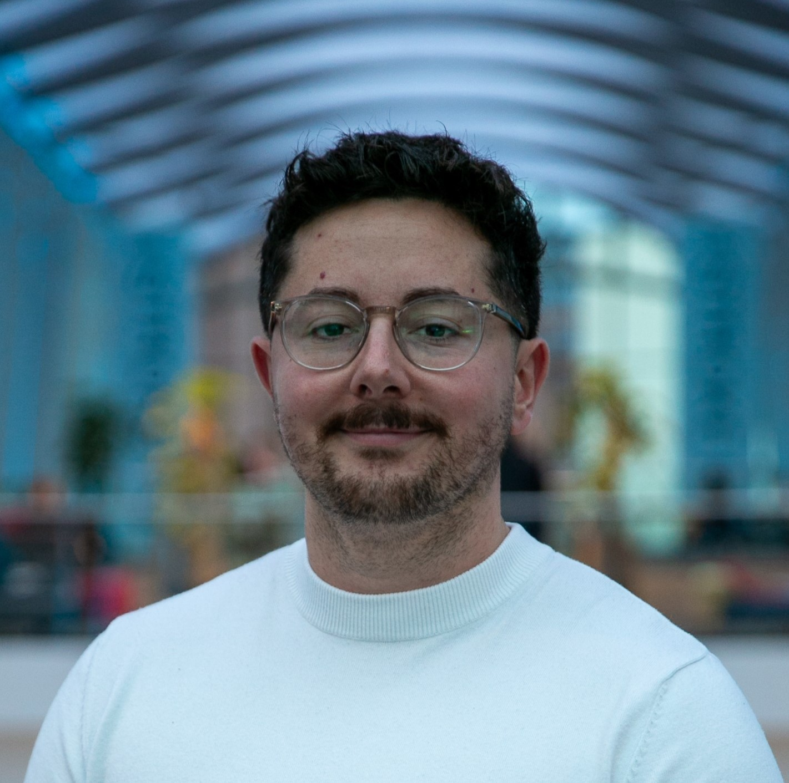

[Funded by The Stroke Association with a Postdoctoral Research Fellowship]{style="color:dodgerblue"}

{width="40%"}

Experienced neuropsychological researcher with a Ph.D. and over eight years of hands-on expertise in developing, validating, and optimising cognitive assessment tools for diverse populations, from children to older adults, and those with acquired brain injury and degenerative neurological conditions. Skilled in leading end-to-end test development processes in research, from concept and piloting through to data analysis and implementation, combining deep knowledge of cognitive neuroscience with a practical, user-focused approach. Recognized for academic excellence and awarded two independent fully-funded fellowship by the Stroke Association. Adept at personal and group project management. 

On the whole, my focus is on cognition and how we measure **cognitive dysfunction** in acquired brain injury. I am particularly interested in clinical tool development, especially **validation** work, and **neuropsychology**.

As of the 2024/2025 academic year, I am a postdoctoral researcher at the **University of Oxford** [Department of Clinical Neurosciences](https://www.ndcn.ox.ac.uk/team/sam-s-webb).  

I completed DPhil at the [Department of Experimental Psychology](https://www.psy.ox.ac.uk/) at University of Oxford, for the [Translational Neuropsychology Lab](https://www.psy.ox.ac.uk/research/translational-neuropsychology), and I was funded via a Postgraduate Fellowship through [The Stroke Association](https://www.stroke.org.uk). 

I completed my MSc in [Psychological Research](https://www.ox.ac.uk/admissions/graduate/courses/msc-psychological-research?wssl=1) at the University of Oxford in England, and completed a BSc in [Psychology with Neuropsychology](https://www.bangor.ac.uk/courses/undergraduate/C801-Psychology-with-Neuropsychology) from Bangor University, in North Wales.  

*Stroke Association are copyright holders for the profile image*.  
